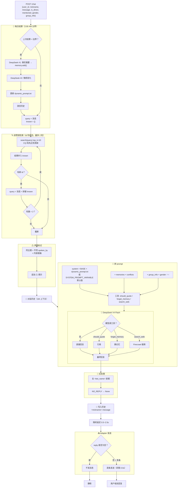

# Agent 完整流程

```mermaid
flowchart TD
    START["POST /chat<br/>{user_id, nickname, message, is_direct, mentioned, gender, group_info}"] --> SETTLE

    subgraph SETTLE["📅 每日结算（2:00 AM 分界）"]
        SL1{"上次结算 &lt; 边界？"}
        SL1 -- 是 --> SL2["DeepSeek #1: 事实摘要 → memory.add()"]
        SL2 --> SL2b["DeepSeek #2: 情感变化"]
        SL2b --> SL3["更新 dynamic_prompt.txt"]
        SL3 --> SL4["清空历史"]
        SL4 --> S0
        SL1 -- 否 --> S0
    end

    S0["query = 消息<br/>known = {}"] --> S1

    subgraph SEARCH["🔍 滚雪球检索（id 判闭合，最多 2 轮）"]
        S1["search(query) top_k=10<br/>CQ 码先正则清掉"] --> S2["结果并入 known"]
        S2 --> S3{"有新 id？"}
        S3 -- 是 --> S4["query = 消息 + 拼接 known"]
        S4 --> S5{"轮数 &lt; 2？"}
        S5 -- 是 --> S1
        S5 -- 否 --> S6["截断"]
        S3 -- 否 --> S6
    end

    S6 --> C1

    subgraph CONFLICT["⚠ 矛盾标记"]
        C1["同主题 + 不同 spoken_by<br/>+ 内容抵触"] --> C2["追加 ⚠ 提示"]
    end

    C2 --> LOAD["📂 对话历史（1M 上下文）"]

    LOAD --> BUILD

    subgraph BUILD["📝 拼 prompt"]
        B1["system = BASE + dynamic_prompt.txt<br/>或 SYSTEM_PROMPT_VARIABLE 默认值"] --> B4
        B2["+ memories + conflicts"] --> B4
        B3["+ group_info + gender ♂♀"] --> B4
        B4["工具: should_quote / forget_memory / search_web"] --> DS
    end

    subgraph DS["🧠 DeepSeek V4 Flash"]
        D1{"模型调工具？"}
        D1 -- 否 --> D2["直接回复"]
        D1 -- should_quote --> D3["引用"]
        D1 -- forget_memory --> D5["删记忆"]
        D1 -- search_web --> D6["Firecrawl 搜索"]
        D2 --> D4["最终回复"]
        D3 --> D4
        D5 --> D4
        D6 --> D4
    end

    D4 --> STRIP

    subgraph STRIP["🧹 后处理"]
        SP1["去 &lt;bot_name&gt; 前缀"] --> SP2["NO_REPLY → None"]
    end

    SP2 --> HISTORY["💾 写入历史<br/>&lt;nickname&gt; message"]

    HISTORY --> DELAY["随机延迟 0.5~2.5s"]

    DELAY --> SEND

    subgraph SEND["📤 Adapter 发送"]
        AD1{"reply 是否为空？"}
        AD1 -- 是 --> AD2["不发消息"]
        AD1 -- 否 + 多条 --> AD3["逐条发送（间隔 0.6s）"]
    end

    AD3 --> END1["用户收到回复"]
    AD2 --> END2["静默"]
```

