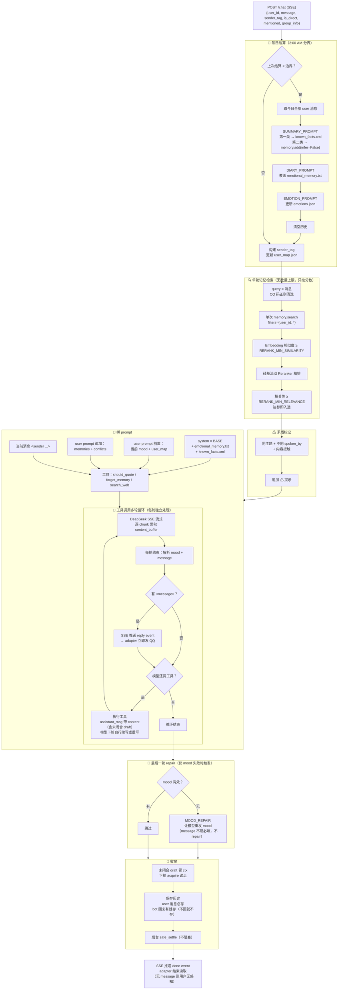

# Agent 完整流程

```mermaid
flowchart TD
    START["POST /chat (SSE)<br/>{user_id, message, sender_tag, is_direct, mentioned, group_info}"] --> SETTLE

    subgraph SETTLE["📅 每日结算（2:00 AM 分界）"]
        SL1{"上次结算 &lt; 边界？"}
        SL1 -- 是 --> SL2["取今日全部 user 消息"]
        SL2 --> SL3["SUMMARY_PROMPT<br/>第一类 → known_facts.xml<br/>第二类 → memory.add(infer=False)"]
        SL3 --> SL4["DIARY_PROMPT<br/>覆盖 emotional_memory.txt"]
        SL4 --> SL5["EMOTION_PROMPT<br/>更新 emotions.json"]
        SL5 --> SL6["清空历史"]
        SL6 --> S0
        SL1 -- 否 --> S0
    end

    S0["构建 sender_tag<br/>更新 user_map.json"] --> S1

    subgraph SEARCH["🔍 单轮记忆检索（无数量上限，只按分数）"]
        S1["query = 消息<br/>CQ 码正则清洗"] --> S2["单次 memory.search<br/>filters={user_id: *}"]
        S2 --> S3["Embedding 相似度 ≥ RERANK_MIN_SIMILARITY"]
        S3 --> S4["硅基流动 Reranker 精排"]
        S4 --> S5["相关性 ≥ RERANK_MIN_RELEVANCE<br/>达标即入选"]
    end

    S5 --> C1

    subgraph CONFLICT["⚠ 矛盾标记"]
        C1["同主题 + 不同 spoken_by<br/>+ 内容抵触"] --> C2["追加 ⚠ 提示"]
    end

    C2 --> BUILD

    subgraph BUILD["📝 拼 prompt"]
        B1["system = BASE<br/>+ emotional_memory.txt<br/>+ known_facts.xml"] --> B5
        B2["user prompt 前置：<br/>当前 mood + user_map"] --> B5
        B3["user prompt 追加：<br/>memories + conflicts"] --> B5
        B4["当前消息 &lt;sender ...&gt;"] --> B5
        B5["工具：should_quote / forget_memory / search_web"] --> LOOP
    end

    subgraph LOOP["🔄 工具调用多轮循环（每轮独立处理）"]
        L1["DeepSeek SSE 流式<br/>逐 chunk 累积 content_buffer"] --> L2["每轮结束：解析 mood + message"]
        L2 --> L3{"有 &lt;message&gt;？"}
        L3 -- 是 --> L4["SSE 推送 reply event<br/>→ adapter 立即发 QQ"]
        L3 -- 否 --> L5
        L4 --> L5{"模型还调工具？"}
        L5 -- 是 --> L6["执行工具<br/>assistant_msg 带 content（含未闭合 draft）<br/>模型下轮自行续写或重写"]
        L6 --> L1
        L5 -- 否 --> LDONE["循环结束"]
    end

    LDONE --> REPAIR

    subgraph REPAIR["📄 最后一轮 repair（仅 mood 失败时触发）"]
        R1{"mood 有效？"}
        R1 -- 无 --> R2["MOOD_REPAIR<br/>让模型重发 mood<br/>（message 不是必填，不 repair）"]
        R1 -- 有 --> R3["跳过"]
    end

    R2 --> FINAL
    R3 --> FINAL

    subgraph FINAL["💾 收尾"]
        F1["未闭合 draft 留 ctx<br/>下轮 acquire 读走"]
        F2["保存历史<br/>user 消息必存<br/>bot 回复有就存（不回就不存）"]
        F3["后台 safe_settle（不阻塞）"]
        F1 --> F2 --> F3
    end

    F3 --> SSE_DONE["SSE 推送 done event<br/>adapter 结束读取<br/>（无 message 则用户无感知）"]
```
