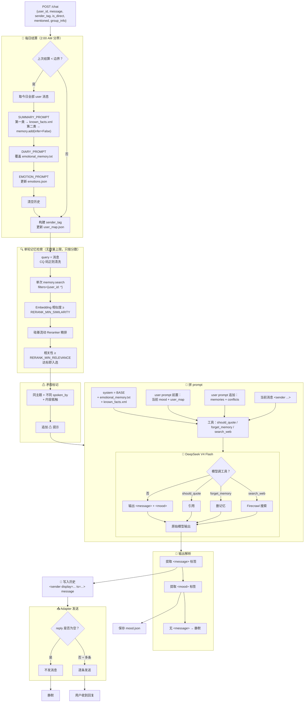

# Agent 完整流程

```mermaid
flowchart TD
    START["POST /chat<br/>{user_id, message, sender_tag, is_direct, mentioned, group_info}"] --> SETTLE

    subgraph SETTLE["📅 每日结算（2:00 AM 分界）"]
        SL1{"上次结算 &lt; 边界？"}
        SL1 -- 是 --> SL2["取今日全部 user 消息"]
        SL2 --> SL3["SUMMARY_PROMPT<br/>第一类 → known_facts.xml<br/>第二类 → memory.add(infer=False)"]
        SL3 --> SL4["DIARY_PROMPT<br/>覆盖 emotional_memory.txt"]
        SL4 --> SL5["EMOTION_PROMPT<br/>更新 emotions.json"]
        SL5 --> SL6["清空历史"]
        SL6 --> S0
        SL1 -- 否 --> S0
    end

    S0["构建 sender_tag<br/>更新 user_map.json"] --> S1

    subgraph SEARCH["🔍 单轮记忆检索（无数量上限，只按分数）"]
        S1["query = 消息<br/>CQ 码正则清洗"] --> S2["单次 memory.search<br/>filters={user_id: *}"]
        S2 --> S3["Embedding 相似度 ≥ RERANK_MIN_SIMILARITY"]
        S3 --> S4["硅基流动 Reranker 精排"]
        S4 --> S5["相关性 ≥ RERANK_MIN_RELEVANCE<br/>达标即入选"]
    end

    S5 --> C1

    subgraph CONFLICT["⚠ 矛盾标记"]
        C1["同主题 + 不同 spoken_by<br/>+ 内容抵触"] --> C2["追加 ⚠ 提示"]
    end

    C2 --> BUILD

    subgraph BUILD["📝 拼 prompt"]
        B1["system = BASE<br/>+ emotional_memory.txt<br/>+ known_facts.xml"] --> B5
        B2["user prompt 前置：<br/>当前 mood + user_map"] --> B5
        B3["user prompt 追加：<br/>memories + conflicts"] --> B5
        B4["当前消息 &lt;sender ...&gt;"] --> B5
        B5["工具：should_quote / forget_memory / search_web"] --> DS
    end

    subgraph DS["🧠 DeepSeek V4 Flash"]
        D1{"模型调工具？"}
        D1 -- 否 --> D2["输出 &lt;message&gt; + &lt;mood&gt;"]
        D1 -- should_quote --> D3["引用"]
        D1 -- forget_memory --> D5["删记忆"]
        D1 -- search_web --> D6["Firecrawl 搜索"]
        D2 --> D4["原始模型输出"]
        D3 --> D4
        D5 --> D4
        D6 --> D4
    end

    D4 --> PARSE["解析 XML 输出"]

    subgraph PARSE["📄 输出解析"]
        P1["提取 &lt;message&gt; 标签"] --> P2["提取 &lt;mood&gt; 标签"]
        P2 --> P3["无 &lt;message&gt; → 静默"]
    end

    P2 --> MOOD["保存 mood.json"]
    P1 --> HISTORY["💾 写入历史<br/>&lt;sender display=... ts=...&gt; message"]

    HISTORY --> SEND

    subgraph SEND["📤 Adapter 发送"]
        AD1{"reply 是否为空？"}
        AD1 -- 是 --> AD2["不发消息"]
        AD1 -- 否 + 多条 --> AD3["逐条发送"]
    end

    AD3 --> END1["用户收到回复"]
    AD2 --> END2["静默"]
```
