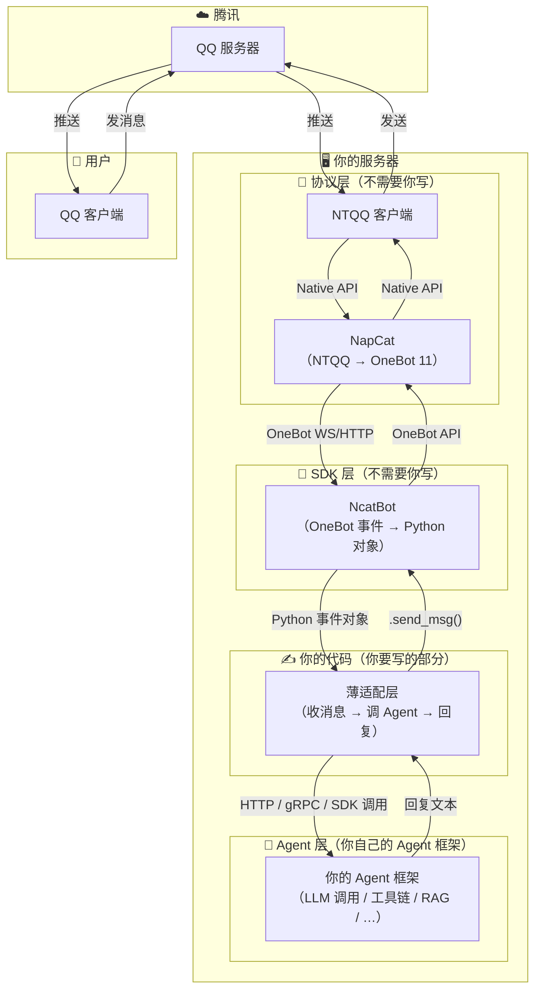

# NapCat + NcatBot + 自定义 Agent 架构

```mermaid
flowchart TD
    subgraph 腾讯侧["☁️ 腾讯"]
        QQServer["QQ 服务器"]
    end

    subgraph 你的服务器["🖥️ 你的服务器"]
        subgraph 协议层["🔌 协议层（不需要你写）"]
            NTQQ["NTQQ 客户端"]
            NapCat["NapCat\n（NTQQ → OneBot 11）"]
        end

        subgraph SDK层["🐍 SDK 层（不需要你写）"]
            NcatBot["NcatBot\n（OneBot 事件 → Python 对象）"]
        end

        subgraph 你的代码["✍️ 你的代码（你要写的部分）"]
            Adapter["薄适配层\n（收消息 → 调 Agent → 回复）"]
        end

        subgraph Agent层["🧠 Agent 层（你自己的 Agent 框架）"]
            YourAgent["你的 Agent 框架\n（LLM 调用 / 工具链 / RAG / …）"]
        end
    end

    subgraph 用户侧["👤 用户"]
        QQClient["QQ 客户端"]
    end

    QQClient -->|"发消息"| QQServer
    QQServer -->|"推送"| NTQQ
    NTQQ -->|"Native API"| NapCat
    NapCat -->|"OneBot WS/HTTP"| NcatBot
    NcatBot -->|"Python 事件对象"| Adapter
    Adapter -->|"HTTP / gRPC / SDK 调用"| YourAgent
    YourAgent -->|"回复文本"| Adapter
    Adapter -->|".send_msg()"| NcatBot
    NcatBot -->|"OneBot API"| NapCat
    NapCat -->|"Native API"| NTQQ
    NTQQ -->|"发送"| QQServer
    QQServer -->|"推送"| QQClient
```
