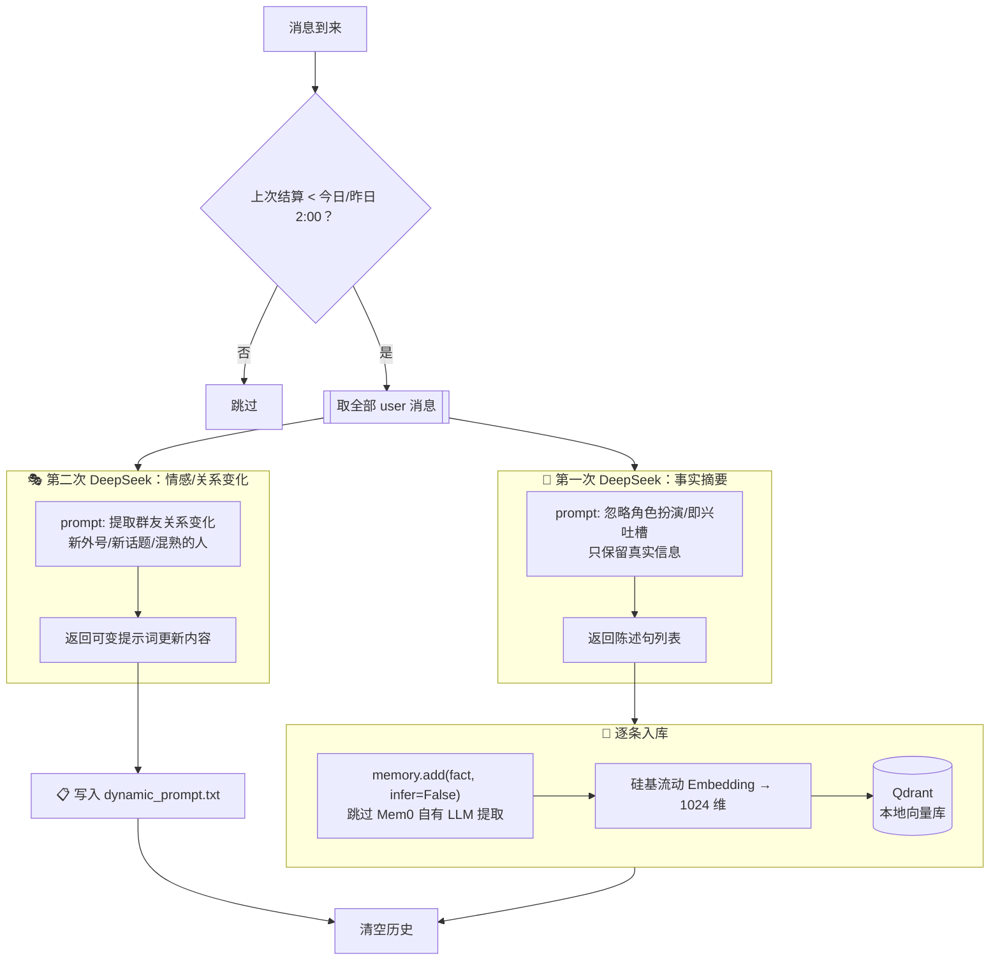
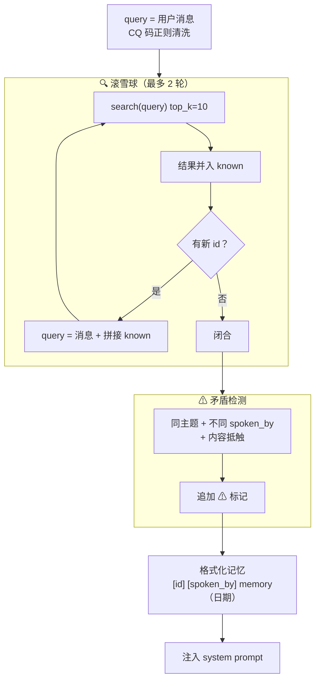
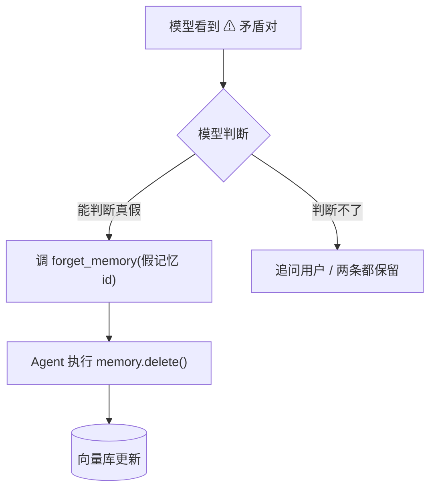
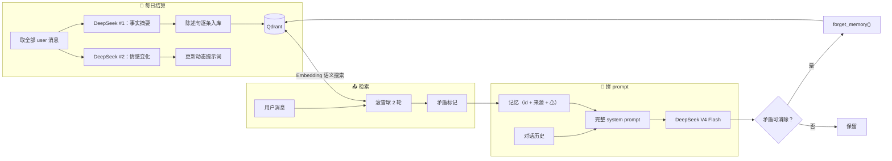

# 记忆模块流程图

## 每日结算（2:00 AM 分界触发）

```mermaid
flowchart TD
    BOUNDARY["消息到来"] --> CHECK{"上次结算 &lt; 今日/昨日 2:00？"}
    CHECK -- 否 --> SKIP["跳过"]
    CHECK -- 是 --> H[["取全部 user 消息"]]

    H --> FACTS

    subgraph FACTS["📝 第一次 DeepSeek：事实摘要"]
        F1["prompt: 忽略角色扮演/即兴吐槽<br/>只保留真实信息"] --> F2["返回陈述句列表"]
    end

    F2 --> STORE

    subgraph STORE["💾 逐条入库"]
        M1["memory.add(fact, infer=False)<br/>跳过 Mem0 自有 LLM 提取"]
        M1 --> M2["硅基流动 Embedding → 1024 维"]
        M2 --> M3[("Qdrant<br/>本地向量库")]
    end

    H --> EMOTION

    subgraph EMOTION["🎭 第二次 DeepSeek：情感/关系变化"]
        E1["prompt: 提取群友关系变化<br/>新外号/新话题/混熟的人"] --> E2["返回可变提示词更新内容"]
    end

    E2 --> DYNAMIC["📋 写入 dynamic_prompt.txt"]

    DYNAMIC --> CLEAR["清空历史"]
    STORE --> CLEAR
```

## 检索（用户发新消息时）

```mermaid
flowchart TD
    START["query = 用户消息<br/>CQ 码正则清洗"] --> SEARCH

    subgraph SEARCH["🔍 滚雪球（最多 2 轮）"]
        S1["search(query) top_k=10"] --> S2["结果并入 known"]
        S2 --> S3{"有新 id？"}
        S3 -- 是 --> S4["query = 消息 + 拼接 known"]
        S4 --> S1
        S3 -- 否 --> S5["闭合"]
    end

    S5 --> CONFLICT

    subgraph CONFLICT["⚠ 矛盾检测"]
        C1["同主题 + 不同 spoken_by<br/>+ 内容抵触"] --> C2["追加 ⚠ 标记"]
    end

    C2 --> FORMAT["格式化记忆<br/>[id] [spoken_by] memory（日期）"]

    FORMAT --> INJECT["注入 system prompt"]
```

## 矛盾消除（模型裁决）

```mermaid
flowchart TD
    A["模型看到 ⚠ 矛盾对"] --> B{"模型判断"}
    B -- "能判断真假" --> C["调 forget_memory(假记忆 id)"]
    C --> D["Agent 执行 memory.delete()"]
    D --> E[("向量库更新")]
    B -- "判断不了" --> F["追问用户 / 两条都保留"]
```

## 整体

```mermaid
flowchart LR
    subgraph 结算["📅 每日结算"]
        ST0["取全部 user 消息"] --> ST1["DeepSeek #1：事实摘要"]
        ST0 --> ST4a["DeepSeek #2：情感变化"]
        ST1 --> ST2["陈述句逐条入库"]
        ST4a --> ST4["更新动态提示词"]
        ST2 --> ST3[("Qdrant")]
    end

    subgraph 检索["📤 检索"]
        SR1["用户消息"] --> SR2["滚雪球 2 轮"] --> SR3["矛盾标记"]
    end

    ST3 <-->|"Embedding 语义搜索"| SR2

    subgraph 消费["💬 拼 prompt"]
        SR3 --> C1["记忆（id + 来源 + ⚠）"]
        C2["对话历史"] --> C3["完整 system prompt"]
        C1 --> C3
        C3 --> C4["DeepSeek V4 Flash"]
    end

    C4 --> D{"矛盾可消除？"}
    D -- 是 --> E["forget_memory()"]
    E --> ST3
    D -- 否 --> F["保留"]
```

> **核心原则**：每日结算摘要 → 逐条入库 → 搜索时矛盾标记 → 模型裁决闭环。不每轮存，不 1536 维，不 8 轮雪球。
