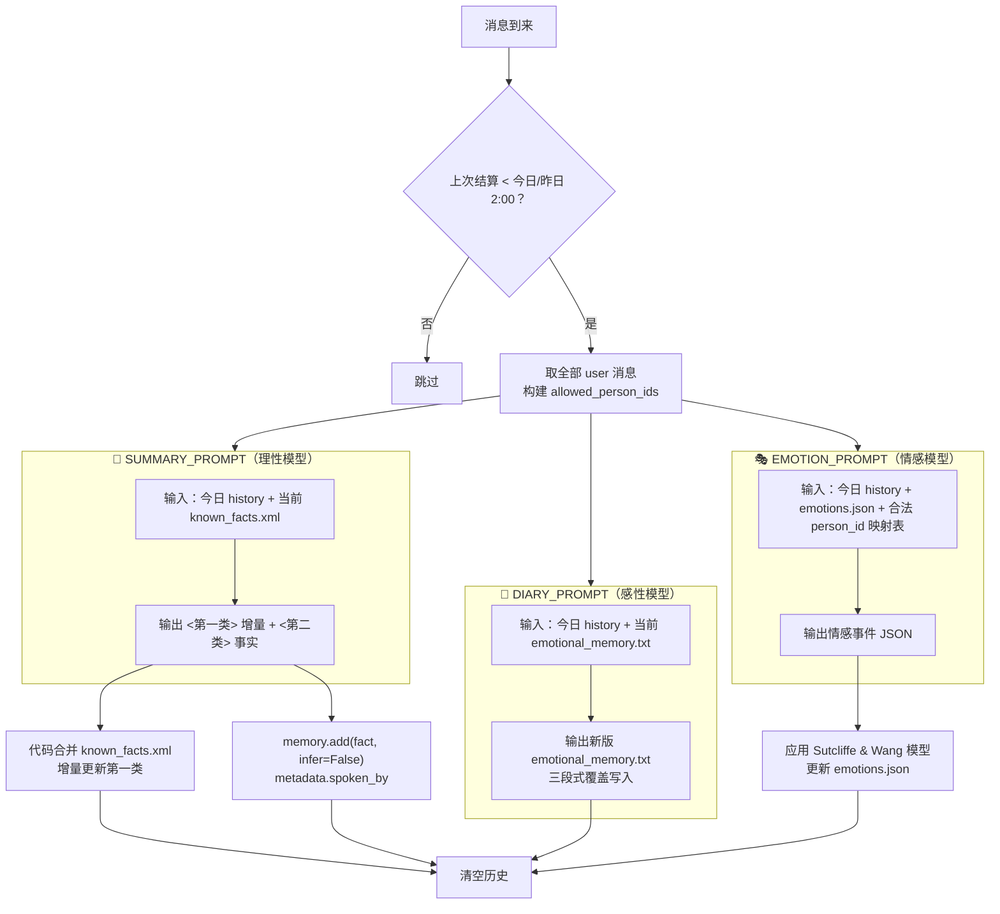
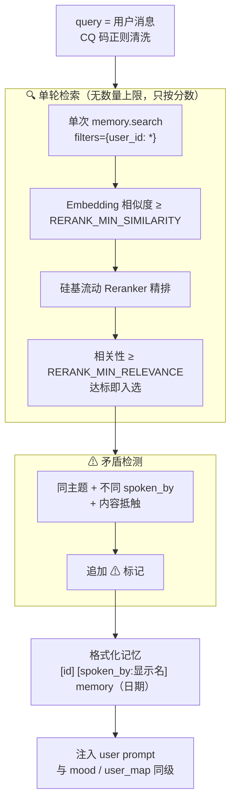
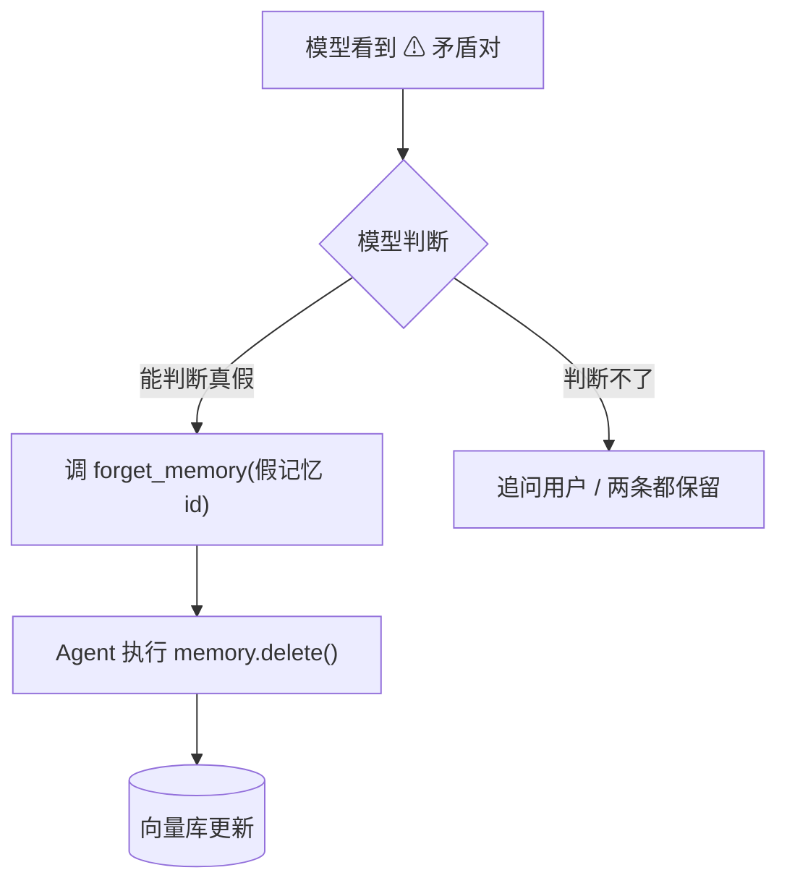
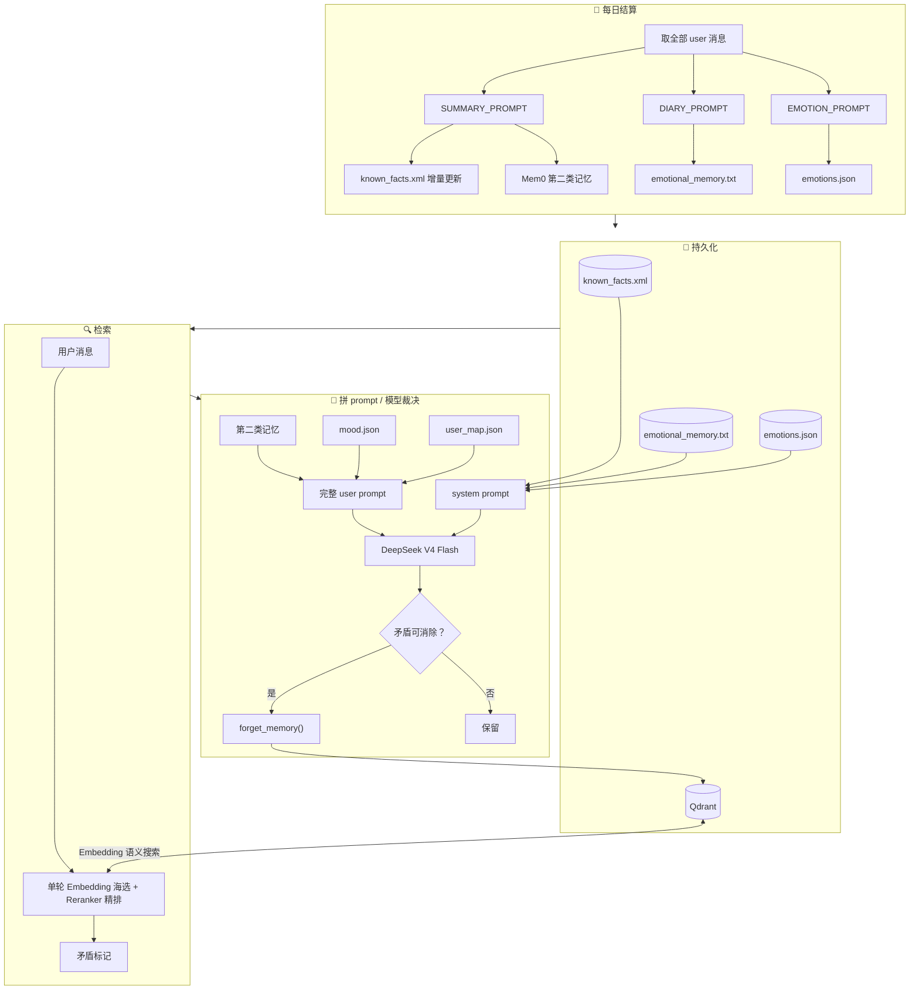

# 记忆模块流程图

## 每日结算（2:00 AM 分界触发）

## 检索（用户发新消息时）

## 矛盾消除（模型裁决）

## 整体（纵向）

> **核心原则**：每日结算摘要 → 第一类进 XML、第二类进 Mem0、日记进 emotional_memory.txt、情感进 emotions.json → 单轮语义检索（无数量上限，只按双门槛分数）→ 矛盾标记 → 模型裁决闭环。第一类走 system prompt，第二类走 user prompt。
